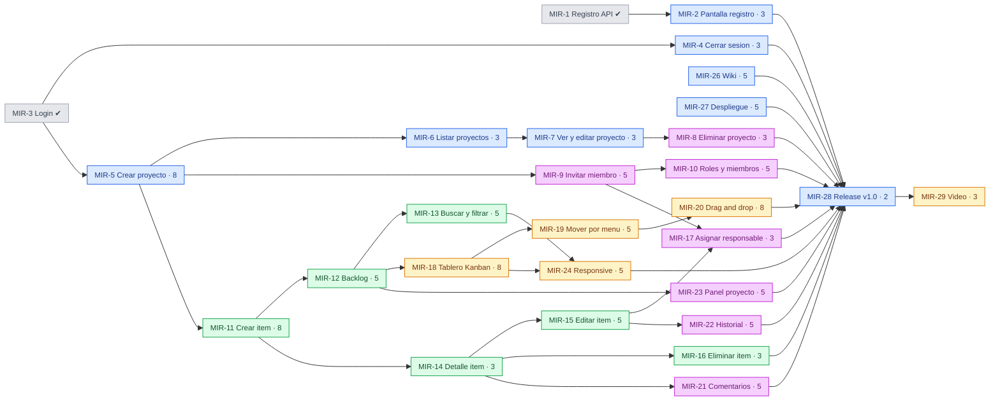

# Plan de trabajo — Entrega 1

Reparto de los 26 items pendientes entre los cuatro integrantes, y el orden en
que conviene abordarlos según sus dependencias reales.

**Estado de partida:** `MIR-1`, `MIR-3` y `MIR-25` ya están Hechos (12 pts).
Quedan **26 items · 121 story points**.

Los items `MIR-30` a `MIR-33` **no se trabajan en esta entrega**: están
reservados como los dos requerimientos nuevos que exige la Entrega 2.

---

## 1. Reparto por integrante

El criterio no es repartir puntos parejos, sino que cada persona sea dueña de
un **módulo completo**. Como el backend está organizado por feature
(`src/modules/<feature>/`) y el frontend también (`src/features/<feature>/`),
cada integrante trabaja casi siempre en sus propios archivos: menos conflictos
de merge y responsabilidad clara sobre cada parte.

### Benjamín — Cuenta, Proyectos y Entrega · 32 pts

| Item | Pts | Prioridad | Descripción |
| --- | --- | --- | --- |
| `MIR-2` | 3 | Highest | Pantalla de registro (Web) |
| `MIR-4` | 3 | Highest | Cerrar sesión y sesión persistente |
| `MIR-5` | 8 | Highest | Crear proyecto (API + pantalla web) |
| `MIR-6` | 3 | Highest | Listar mis proyectos |
| `MIR-7` | 3 | High | Ver y editar un proyecto |
| `MIR-27` | 5 | High | Despliegue del ambiente de demostración |
| `MIR-26` | 5 | High | Wiki del proyecto |
| `MIR-28` | 2 | Highest | Release `v1.0-entrega1` |

Lleva la infraestructura porque ya montó el andamiaje. **`MIR-5` bloquea a los
otros tres**, así que va primero, antes incluso que `MIR-2`.

### Isaías — Elementos de trabajo · 29 pts

| Item | Pts | Prioridad | Descripción |
| --- | --- | --- | --- |
| `MIR-11` | 8 | Highest | Crear un elemento de trabajo |
| `MIR-12` | 5 | Highest | Listar el backlog con paginación |
| `MIR-14` | 3 | High | Ver el detalle de un elemento |
| `MIR-15` | 5 | Highest | Editar un elemento de trabajo |
| `MIR-16` | 3 | High | Eliminar un elemento de trabajo |
| `MIR-13` | 5 | High | Buscar y filtrar el backlog |

Es el corazón del producto y el módulo más grande. `MIR-11` y `MIR-12`
desbloquean al resto del equipo, así que son lo primero.

### Mauro — Tablero Kanban y experiencia · 29 pts

| Item | Pts | Prioridad | Descripción |
| --- | --- | --- | --- |
| `MIR-18` | 8 | Highest | Visualizar el tablero Kanban |
| `MIR-19` | 5 | Highest | Cambiar estado desde el menú de la tarjeta |
| `MIR-20` | 8 | Medium | Arrastrar y soltar tarjetas |
| `MIR-24` | 5 | High | Diseño responsive |
| `MIR-29` | 3 | High | Cápsula de video de la Entrega 1 |

Arranca más tarde que los demás porque depende de `MIR-12`. Mientras espera,
puede adelantar el maquetado del tablero con datos falsos y las primeras
pruebas de RTL con MSW.

### Diego — Equipo, permisos y colaboración · 31 pts

| Item | Pts | Prioridad | Descripción |
| --- | --- | --- | --- |
| `MIR-9` | 5 | High | Invitar a un miembro al proyecto |
| `MIR-10` | 5 | Medium | Cambiar rol y quitar miembros |
| `MIR-8` | 3 | Medium | Eliminar un proyecto |
| `MIR-17` | 3 | High | Asignar un responsable |
| `MIR-21` | 5 | Medium | Comentar un elemento de trabajo |
| `MIR-22` | 5 | Medium | Historial de cambios de un elemento |
| `MIR-23` | 5 | Medium | Panel del proyecto |

Todo lo que involucra permisos pasa por la función `can()` de
`packages/shared`, que ya está implementada y cubierta con 61 casos de prueba.
Su trabajo es aplicarla, no reinventarla.

---

## 2. DAG de dependencias

Cada flecha significa *"esto tiene que existir antes"*. El color indica quién
es el responsable.



| Color | Responsable |
| --- | --- |
| Gris | Ya está Hecho |
| Azul | Benjamín |
| Verde | Isaías |
| Amarillo | Mauro |
| Morado | Diego |

`MIR-26` (Wiki) y `MIR-27` (despliegue) no tienen predecesores: **se pueden
empezar hoy**, en paralelo con todo lo demás.

---

## 3. La ruta crítica

La cadena más larga del grafo define el mínimo de tiempo posible, sin importar
cuánta gente sume:

```
MIR-5 → MIR-11 → MIR-12 → MIR-18 → MIR-19 → MIR-20 → MIR-28 → MIR-29
  5       8        5        8        5        8        2        3      = 44 pts
```

Dos consecuencias prácticas:

1. **`MIR-5` y `MIR-11` bloquean al equipo completo.** Juntos son 13 puntos y
   están al principio de todo. Si se atrasan, se atrasa todo, y nadie más puede
   avanzar de verdad. Vale la pena hacerlos en pareja (*mob programming*, que
   el enunciado permite y recomienda explícitamente) aunque parezca ineficiente:
   terminar `MIR-11` un día antes le devuelve un día a tres personas.

2. **La ruta cruza tres personas** (Benjamín → Isaías → Mauro). Los traspasos
   son el riesgo real. Cuando Isaías termine `MIR-12`, avisar de inmediato:
   Mauro está bloqueado hasta ese momento.

`MIR-20` (arrastrar y soltar, 8 pts) está en la ruta crítica y **no es
obligatorio**: el enunciado pide "movimiento de elementos entre estados", que
ya cumple `MIR-19` con el menú. Si el calendario aprieta, es el primer
candidato a sacrificar, y recorta 8 puntos del camino más largo.

---

## 4. Orden sugerido por olas

### Ola 0 — se puede empezar ya, sin esperar a nadie

| Quién | Item |
| --- | --- |
| Benjamín | `MIR-5` crear proyecto ← **empezar por aquí, bloquea a todos** |
| Benjamín | `MIR-27` despliegue (en paralelo, es independiente) |
| Diego | Leer `can()` y el esquema Prisma; preparar `MIR-9` |
| Isaías | Diseñar la generación de `reference` correlativa de `MIR-11` |
| Mauro | Maquetar el tablero con datos falsos y sus pruebas con MSW |

### Ola 1 — apenas exista `MIR-5`

`MIR-11` (Isaías, crítico) · `MIR-6` y `MIR-2` (Benjamín) · `MIR-9` (Diego)

### Ola 2 — apenas exista `MIR-11`

`MIR-12` y `MIR-14` (Isaías) · `MIR-7` y `MIR-4` (Benjamín) · `MIR-10` (Diego)

### Ola 3 — apenas exista `MIR-12`

`MIR-18` (Mauro, crítico) · `MIR-13` (Isaías) · `MIR-15` y `MIR-16` (Isaías) ·
`MIR-23` y `MIR-21` (Diego)

### Ola 4 — cierre de funcionalidad

`MIR-19` y `MIR-20` (Mauro) · `MIR-17` y `MIR-22` (Diego) · `MIR-8` (Diego) ·
`MIR-24` (Mauro)

### Ola 5 — entrega

`MIR-26` Wiki (Benjamín, pero se alimenta durante todo el semestre) ·
`MIR-28` release · `MIR-29` video

---

## 5. Reglas de trabajo

**Ramas.** Una por item, siempre desde `develop`:

```
feature/MIR-11-crear-elemento-de-trabajo
```

**Revisión cruzada, en rueda.** Cada quien revisa los PR del siguiente:

```
Benjamín → Isaías → Mauro → Diego → Benjamín
```

Así nadie se transforma en cuello de botella y todos leen código de un módulo
que no es el suyo. Si el revisor asignado no está disponible en el día,
cualquier otro integrante puede aprobar: `main` exige una aprobación, no una
en particular.

**Definición de Hecho.** Un item pasa a Hecho sólo cuando:

- el PR está fusionado en `develop`;
- la funcionalidad tiene pruebas en el nivel que le corresponda (unitaria para
  reglas, integración para rutas, RTL para pantallas);
- CI está en verde;
- el tablero de Jira está actualizado, no al día siguiente.

**Zonas compartidas.** Tres archivos los tocan todos y son los que van a
generar conflictos:

| Archivo | Regla |
| --- | --- |
| `apps/api/prisma/schema.prisma` | avisar al grupo antes de migrar; una migración por PR |
| `packages/shared/src/schemas/` | agregar, no reescribir lo ajeno |
| `apps/web/src/App.tsx` | sólo agregar la ruta propia |

**Lo que no se toca.** `MIR-30` a `MIR-33` son de la Entrega 2. Construir
Sprints ahora deja al equipo sin requerimientos nuevos que presentar en
noviembre, que es un requisito explícito de esa entrega.
