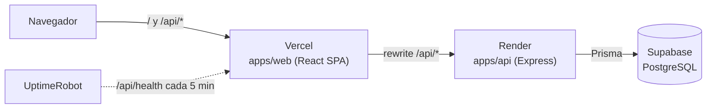
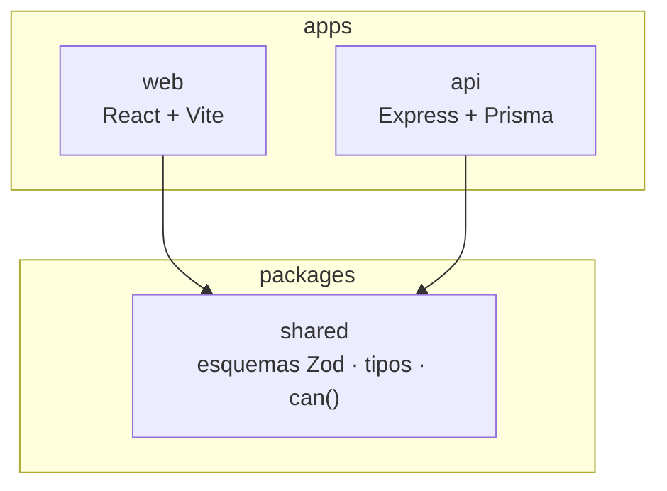
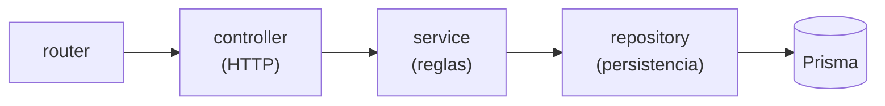

# Proyecto - Arquitectura y tecnologías

## Vista general

El navegador ve **un solo origen**: Vercel reenvía `/api` a Render, así que la
cookie de sesión es first-party y funciona también en Safari e incógnito
([D13](https://github.com/MiraPdS/mira/blob/develop/docs/decisiones-tecnicas.md#d13--mismo-origen-mediante-rewrite-de-vercel)).
Cómo se monta y se recrea: [`docs/despliegue.md`](https://github.com/MiraPdS/mira/blob/develop/docs/despliegue.md).

## Estructura del repositorio

Monorepo con npm workspaces
([D1](https://github.com/MiraPdS/mira/blob/develop/docs/decisiones-tecnicas.md#d1--monorepo-con-npm-workspaces)):
una historia que toca frontend y backend es una rama, un PR y un item de Jira.

`packages/shared` es el **contrato**: el mismo esquema Zod valida el formulario
de React y la petición en Express, y la misma función `can(rol, permiso)`
decide qué se muestra en la interfaz y qué permite la API.

## Capas del backend

Cada módulo (`auth`, `projects`, `work-items`, `comments`, `health`) sigue la
misma cadena:

El `service` recibe el repositorio por parámetro y lanza errores de dominio sin
conocer Express ni Prisma. **Esa es la decisión que hace barato probar:** las
reglas se verifican con un doble en milisegundos, y las rutas completas con
Supertest contra un PostgreSQL real.

## Tecnologías y su relación con las pruebas

| Capa | Tecnología | Qué aporta a las pruebas |
| --- | --- | --- |
| Frontend | React 18 + TypeScript + Vite | Vitest reutiliza la configuración de Vite: la app y sus pruebas se compilan igual |
| Estado de servidor | TanStack Query | Estados de carga y error explícitos, fáciles de asertar con RTL |
| Formularios | react-hook-form + Zod | El esquema que valida en la UI es el mismo que se prueba en `shared` |
| UI | Tailwind CSS 4 + shadcn/ui | Componentes con roles ARIA correctos: RTL los encuentra por rol y etiqueta |
| Tablero | dnd-kit + menú "Mover a…" | El menú da un camino determinista para RTL y para los E2E de la Entrega 3 ([D9](https://github.com/MiraPdS/mira/blob/develop/docs/decisiones-tecnicas.md#d9--kanban-con-dnd-kit-y-un-camino-alternativo-obligatorio)) |
| Backend | Node 20 + Express + TypeScript | `app` exportable sin abrir puerto: Supertest le hace peticiones directas |
| Base de datos | PostgreSQL 16 (Docker local, Supabase desplegado) | Un PostgreSQL idéntico y efímero en CI ([D6](https://github.com/MiraPdS/mira/blob/develop/docs/decisiones-tecnicas.md#d6--docker-local-para-desarrollo-y-pruebas-supabase-para-lo-desplegado)) |
| ORM | Prisma 6 | Migraciones versionadas que se aplican igual en CI y en producción |
| Validación | Zod (compartido) | Una sola definición del contrato para tipos y runtime |
| Sesión | JWT en cookie `httpOnly` | Los E2E hacen login por la UI y el navegador arrastra la cookie ([D3](https://github.com/MiraPdS/mira/blob/develop/docs/decisiones-tecnicas.md#d3--jwt-en-cookie-httponly)) |
| **Pruebas** | **Vitest + React Testing Library**, Supertest, MSW, `vitest-mock-extended` | Herramienta declarada del equipo. Ver [Estrategia de pruebas](Proyecto-Estrategia-de-pruebas.md) |
| CI | GitHub Actions | Formato, lint, tipos, las tres suites y build en cada PR; check obligatorio de `main` ([D11](https://github.com/MiraPdS/mira/blob/develop/docs/decisiones-tecnicas.md#d11--github-actions-en-la-entrega-1-jenkins-en-la-entrega-2)) |
| Despliegue | Vercel + Render + Supabase | URL pública estable: será la `BASE_URL` de los E2E ([D12](https://github.com/MiraPdS/mira/blob/develop/docs/decisiones-tecnicas.md#d12--despliegue-en-vercel-render-y-supabase)) |

## Decisiones técnicas

Cada decisión tiene su justificación y sus alternativas descartadas en
[`docs/decisiones-tecnicas.md`](https://github.com/MiraPdS/mira/blob/develop/docs/decisiones-tecnicas.md).

| | Decisión |
| --- | --- |
| [D1](https://github.com/MiraPdS/mira/blob/develop/docs/decisiones-tecnicas.md#d1--monorepo-con-npm-workspaces) | Monorepo con npm workspaces |
| [D2](https://github.com/MiraPdS/mira/blob/develop/docs/decisiones-tecnicas.md#d2--supabase-como-postgresql-gestionado-con-prisma-como-orm) | Supabase como PostgreSQL gestionado, con Prisma; sin `supabase-js` ni RLS |
| [D3](https://github.com/MiraPdS/mira/blob/develop/docs/decisiones-tecnicas.md#d3--jwt-en-cookie-httponly) | JWT en cookie `httpOnly` |
| [D4](https://github.com/MiraPdS/mira/blob/develop/docs/decisiones-tecnicas.md#d4--pirámide-de-pruebas-de-dos-niveles-en-el-backend) | Pirámide de dos niveles en el backend: unitario + integración |
| [D5](https://github.com/MiraPdS/mira/blob/develop/docs/decisiones-tecnicas.md#d5--esquemas-zod-compartidos-como-contrato-de-la-api) | Esquemas Zod compartidos como contrato de la API |
| [D6](https://github.com/MiraPdS/mira/blob/develop/docs/decisiones-tecnicas.md#d6--docker-local-para-desarrollo-y-pruebas-supabase-para-lo-desplegado) | Docker local para desarrollo y pruebas; Supabase para lo desplegado |
| [D7](https://github.com/MiraPdS/mira/blob/develop/docs/decisiones-tecnicas.md#d7--roles-por-proyecto-y-una-función-can-pura) | Roles por proyecto y una función `can()` pura |
| [D8](https://github.com/MiraPdS/mira/blob/develop/docs/decisiones-tecnicas.md#d8--estados-del-tablero-como-enum-fijo) | Estados del tablero como enum fijo |
| [D9](https://github.com/MiraPdS/mira/blob/develop/docs/decisiones-tecnicas.md#d9--kanban-con-dnd-kit-y-un-camino-alternativo-obligatorio) | Kanban con dnd-kit y un menú "Mover a…" obligatorio |
| [D10](https://github.com/MiraPdS/mira/blob/develop/docs/decisiones-tecnicas.md#d10--historial-escrito-explícitamente-dentro-de-una-transacción) | Historial escrito dentro de la misma transacción que el cambio |
| [D11](https://github.com/MiraPdS/mira/blob/develop/docs/decisiones-tecnicas.md#d11--github-actions-en-la-entrega-1-jenkins-en-la-entrega-2) | GitHub Actions en la Entrega 1, Jenkins en la Entrega 2 |
| [D12](https://github.com/MiraPdS/mira/blob/develop/docs/decisiones-tecnicas.md#d12--despliegue-en-vercel-render-y-supabase) | Despliegue en Vercel, Render y Supabase |
| [D13](https://github.com/MiraPdS/mira/blob/develop/docs/decisiones-tecnicas.md#d13--mismo-origen-mediante-rewrite-de-vercel) | Mismo origen mediante rewrite de Vercel |

## Herramientas de IA

El equipo usa asistentes de IA como apoyo al desarrollo, con el mismo flujo que
cualquier otro cambio: rama, PR, CI verde y revisión de otro integrante.

| Herramienta | Uso principal |
| --- | --- |
| Claude Code | Planificación de items, implementación, revisión de PRs y documentación |
| Codex | Segunda opinión en implementaciones y diagnóstico de fallos |

Qué se generó con IA y cómo se validó se declara en cada PR y se resume por
entrega, en la sección "Uso de IA" de cada página de entrega
([Entrega 1](Entrega-1.md#uso-de-ia)).

<!-- Generado desde docs/wiki/ en MiraPdS/mira. No editar aquí: se sobrescribe en el próximo sync. -->
